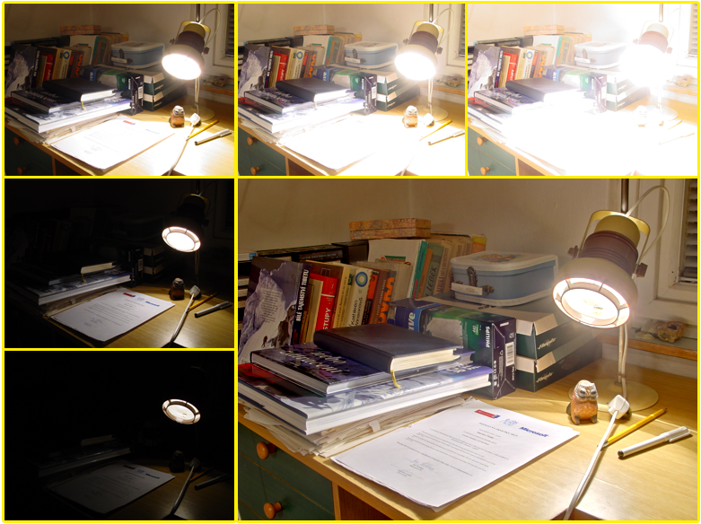

# Fast Multi-Exposure Image Fusion

Source code for the fast multi-exposure image fusion method described in the following paper: 
	
M. Nejati, M. Karimi, S. M. Reza Soroushmehr, N. Karimi, S. Samavi, and Kayvan Najarian, "Fast Exposure Fusion Using Exposedness Function", IEEE International Conference on Image Processing (ICIP), Sept. 2017, pp. 2234-2238. 

Please refer to the above publication if you use this code.

Usage of this code is free for academic use only.

## General information :					 	 
This is a Matlab implementation of fast multi-exposure fusion using exposedness function.
This code has only been tested on 64-bit windows 7 using MATLAB R2012b.

## Reference: 
M. Nejati, M. Karimi, S. M. Reza Soroushmehr, N. Karimi, S. Samavi, and Kayvan Najarian, "Fast Exposure Fusion Using Exposedness Function", IEEE International Conference on Image Processing (ICIP), Sept. 2017, pp. 2234-2238. 

  
## Dependencies :					 	 
The code of fast guided filter originates from Kaiming He's website: 
[http://kaiminghe.com/eccv10/](https://people.csail.mit.edu/kaiming/eccv10/index.html)

## Disclaimer :
This code is provided for non-commercial research purposes only. Use at your own risk. 
No warranty is implied by this distribution. 

